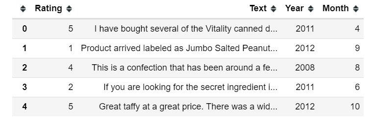
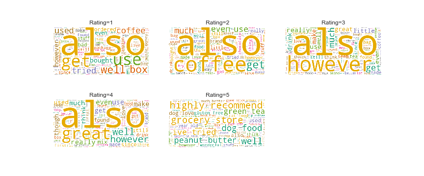
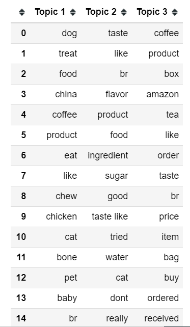
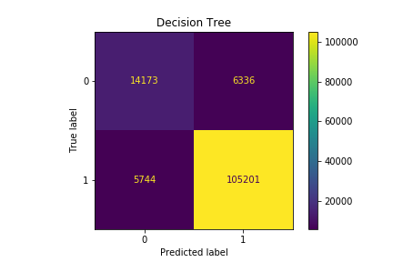
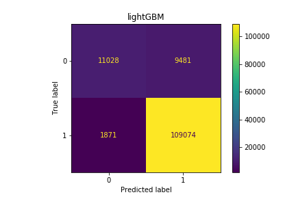
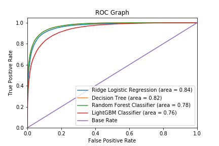

# Amazon-Fine-Food-Review
 

## Introduction
Amazon is a massive online retailer that has a market capitalization as of June 2018 that is in excess of $268 billion U.S. As well as being an online retailer, Amazon allows for individuals and business to sell and display products for sale on line. Although being the pioneer in e-commerce industry and establishing a review platform for its products, its review system can be abused by sellers or customers writing fake reviews in exchange for incentives. 

My personal interest in data, human behavior and a passion for food drove me to choose Amazon fine food review dataset from [Stanford Network Analysis Project (SNAP)](https://snap.stanford.edu/data/web-FineFoods.html) to study customer behavior and draw conclusion using machine learning and natural language processing.

## Data Overview
Dataset has over 500,000 rows and 10 columns dating from 1999 to 2012. It contains information regarding User Id, Product Id, helpfulness of review, review score (1–5 starts), time in Unix format, and review text.  A sample 5-star review text: 'I have bought several of the Vitality canned dog food products and have found them all to be of good quality. The product looks more like a stew than a processed meat and it smells better. My Labrador is finicky and she appreciates this product better than most.'

In this case, I chose review score, time, review text as our major investigated variables. To achieve for more convenience, I transformed time into a datetime format and get year and month correspondingly.
 

## Goal
By looking at the data, I am interested in studying community behavior with respect to the review/reviewer, and impact of time stamp on the review score, as well as an attempt to classify review sentiment and word structure. 

## Data Cleaning
In this stage before getting deeper into analysis:
- The data is inspected for missing value and there are no missing values, which is good!
- The text data is cleaned to remove punctuations (e.g. '=', '+', '-' etc) and stopwords(e.g. 'I', 'you', 'we', 'doesn't' etc) and get lowercased (e.g. 'WE' becomes 'we') and lemmatized (e.g. 'caring' becomes 'care').

## Exploratory Data Analysis
### Distribution of Ratings
 

Around 350,000 customers, approximately 70% of all customers, give a 5-star rating. It means that either 70% of customers are happy with the food or service, or for some reason, the customers’ ratings are biased toward 5-star.
There is still much debate over how the objectivity of the star rating system of review websites. But of course, it’s a subject beyond our scope.

### Numbers of Reviews over Time
 

The left panel above shows the number of reviews over the year. The exponential growth coincides with the growth of Amazon. It shows that Amazon is getting more and more brand awareness over the years.

In the right panel above, we can observe a substantial seasonal variation of the number of reviews and reach their maximum during September and October. A possible explanation for this phenomenon is that people were preparing food for the winter as we can see that number of reviews in November and December are very limited.

### Review Length by Sentiment
 

The graph shows the review length distribution for each rating category. It reveals that high-rating reviews generally have more words than low-rating reviews. We can say that there's some kind of correlation between sentiment and review length. If we want to conduct deeper analysis into this topic, ANOVA test may be helpful to draw a solid conclusion.

### Common Words in Reviews
 

The bar chart clearly shows the most common words appearing in the reviews, including 'like', 'taste', 'flavor' etc and all these words are directly related to food. I just remove top 7 common words for better data cleaning .
 

WordCloud is also a visualized tool for us to see frequent keywords in the groups. The five wordclouds above clearly delivers the message that for positive reviews, most people are probably satisfied with dog food, peanut butter and green tea.

The negative reviews mentioned words like “coffee' . People were probably complaining about the quality of coffee.

## Topic Modelling
By just looking at the word cloud, it’s difficult to digest the information from negative reviews. To find out what aspects a fine food seller should focus on improving, I present the topic modeling with Latent Dirichlet Allocation (LDA).
### Text transformation - TFIDF
Before topic modelling, we need to transform the text data into a form that a computer can recognize. TFIDF is a good way to do that and it works by measuring how important a word or phrase is within a collection of documents. It essentially weigh down terms that appear frequently and scale up unique terms.
To make data more concise, I discard words that appear in > 80% of the reviews discard words that appear in < 10 reviews.

  

The left table illustrates the least important words generated by TFIDF and the right table illustrates the most important words. At this point, we can see words like 'product', 'like', 'good' are commonly used by people but words like 'creamy like', 'pop time', ' flavored cup' are very unusual so TFIDF transform these words into relative weights based on this principle.

### Latent Dirichlet Allocation (LDA)  topic modelling 
 

LDA model allows us to find the topics of the reviews and the crucial words for each topic.
By modeling the reviews with 1-star through LDA, I found three different topics that people care about :
For topic 1, customers mentioned dog, cat, chew, bone, chicken. From these keywords, we can easily see that they complain about the pet food.
In topic 2, we see that taste, flavor, sugar, and ingredient. It probably means that the food is not so delicious.
As for topic 3, there are order, price, box, bag, receive. The customers must be disappointed in the order delivery process.

By putting all the pieces together, we see that to win customers’ hearts; there are three tips. First, we should make sure customers getting their order as smoothly as possible. Secondly, keep the quality of food good and finally, pay more attention on pet food!

## Predicting review sentiments using Natural Language Processing
It should be noted that human nature and understanding sentiments are complex tasks, and review process is very subjective. Sometimes even by looking at a text of a review it is hard to imagine why reviewer chose a certain scoring but here we rely on those scores and treat predicting review sentiments as a binary classification problem by keeping review (1–2) as “bad” with label '0' and (4–5) as “good” reviews with label '1'. 

### Model choosing
Having worked on sentiment analysis with various machine learning algorithms, it was clear there are many methods for classification problem. In this case, I choose logistic regression with regularization, tree-based models including decision tree, random forest and lightGBM. I choose logistic regression because it is the basic model for binary classification and turned it into ridge logistic regression to avoid overfitting . Tree based models often perform very well because they automatically approximate subtle interactions between features. LightGBM is useful in this case because it can handle large data very well with high speed.

### Model Training and Model Comparison
After transforming the text data with TFIDF, I split the training and test data, and then train each model on the training data and predict test data. With the prediction on the test data, I am able to get accuracy and F-1 score which are two important classification metrics from each model. Each model's performance is like below:
| Model             | Accuracy|F-1|
| ----------------- |:-------------:| ------:|
|Lasso Logistic Regression  | 93.58% | 96.26%|
| Decision Tree| 90.81%| 94.57%|
| Random Forest | 92.93% | 95.97%|  
| LGBM|91.36%|95.05%|

Confusion matrix is also a way to evaluate a model's performance, a good model should be good at limiting false positives and false negatives. The confusion matrices are plotted as below:

   
    
From the above observations, it's obvious that ridge regression has the highest accuracy and F-1 score. However, random forest is better at limiting false negatives.

 

To better compare these models, ROC  graph can help us visualize each model's performance based on their curves. The better the model is, the more upper left the curve is. We can see that Ridge Logistic Regression undoubtedly stands out with the highest ROC score. With such a good performance, ridge regression can be successfully used to predict review sentiments for reviews that algorithm never seen before.

### Visualizing important features
For logistic regression, coefficients are good indicators to show the impact of a feature. The larger the absolute value of the coefficient of the feature is, the more important role the feature plays on the output. In this case, if the coefficient of a word is positively large, it means that the word can largely impact the sentiment to be positive and vice versa. Based on the plot below, we can infer that words like great, delicious, best should be more correlated with positive sentiments and words like worst, disappointing and terrible are more correlated with negative sentiments.
 

